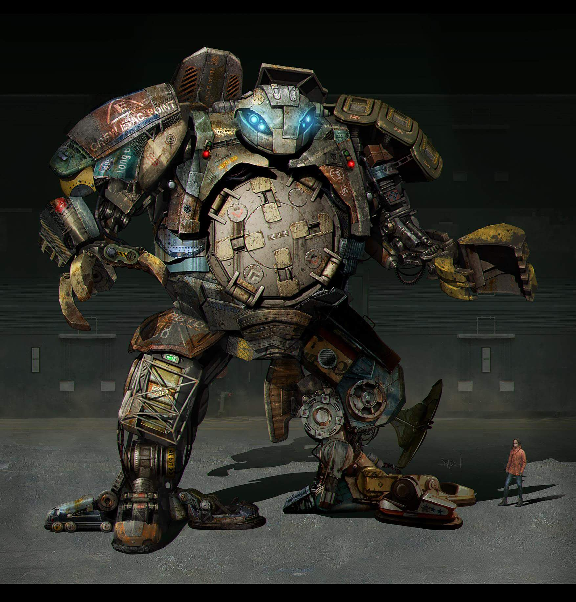

## UNAR梦想
> scrapper,这个小机器人是环太平洋2的一个角色，他本身被小女孩寄托着一个拯救社会的梦想。 
>就像作者想把unar.js做成前端框架的领跑者一样,为提高javascript开发效率，做出一点点帮助。 
> 作者眼中的unar好比环太平洋2中小女孩制造的scrapper

## [Unar介绍](https://github.com/lkdghzh/unar.js)
> Unar是一个的mvvm框架,核心功能已经完成，还有很多[todolist](doc/use/senior.md) 
> 参考vue，knockout,jquery相关开发库， 
> 欢迎star:bowtie:

# 使用文档
> 当前文档还不完善
* [文档](doc/use/entry.md)
* [实现技术点+TodoList](doc/use/senior.md)

# 二次开发文档
> 当前文档还不完善
* [文档](doc/develop/test.md)

# 测试文档
> 当前文档还不完善
* [文档](doc/develop/test.md)